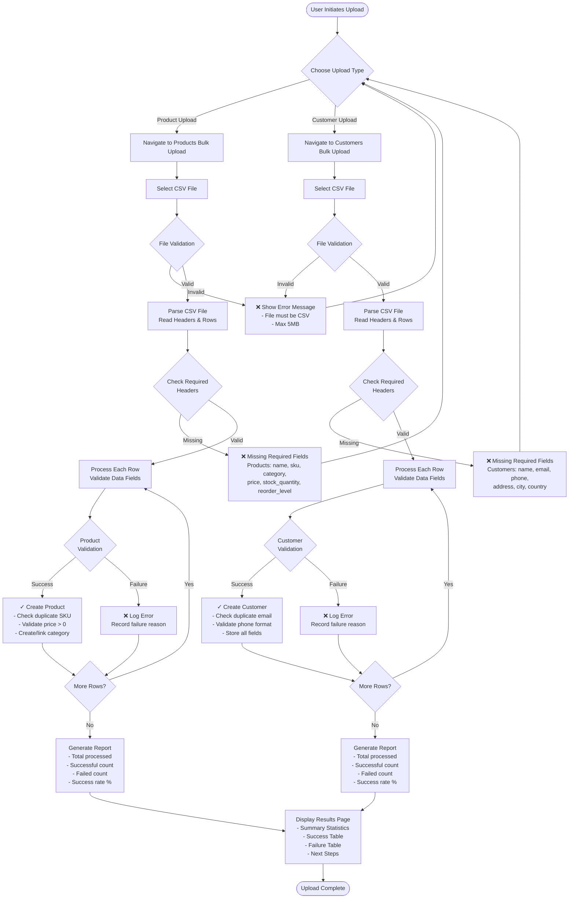
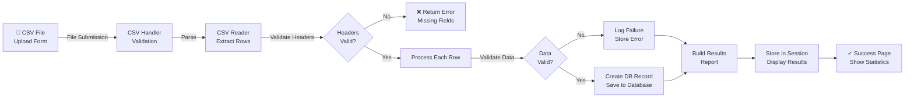

# Bulk CSV Upload System - Flowchart & Documentation

## Overview
This document describes the bulk upload system for Products and Customers in SmartStock App. The system allows users to import large quantities of data via CSV files with comprehensive validation and error handling.

---

## CSV Upload Process Flowchart



---

## Data Flow Diagram



---

## Data Validation Rules

### Product CSV Upload

#### Required Fields:
| Field | Type | Validation |
|-------|------|-----------|
| `name` | String | Max 200 chars, non-empty |
| `sku` | String | Max 50 chars, unique, non-empty |
| `category` | String | Non-empty, auto-create if missing |
| `price` | Float | Positive number, decimal allowed |
| `stock_quantity` | Integer | Non-negative integer |
| `reorder_level` | Integer | Non-negative integer |

#### Optional Fields:
| Field | Type | Validation |
|-------|------|-----------|
| `description` | String | Unlimited text |
| `status` | String | One of: active, inactive, discontinued |

#### Validation Logic:
```python
1. Check if required fields exist in CSV headers
2. For each row:
   - Validate all required fields are non-empty
   - Validate numeric fields (price, quantities)
   - Check for duplicate SKU (must be unique)
   - Validate status is in allowed values
   - Validate price >= 0
   - Validate stock_quantity >= 0
   - Validate reorder_level >= 0
3. If all validations pass: Create Product
4. If any validation fails: Record error and skip row
5. Generate report with success/failure summary
```

### Customer CSV Upload

#### Required Fields:
| Field | Type | Validation |
|-------|------|-----------|
| `name` | String | Max 200 chars, non-empty |
| `email` | Email | Valid format, unique |
| `phone` | String | 10-15 digits, numeric |
| `address` | String | Non-empty |
| `city` | String | Max 100 chars, non-empty |
| `country` | String | Max 100 chars, non-empty |

#### Optional Fields:
| Field | Type | Validation |
|-------|------|-----------|
| `state` | String | Max 100 chars |
| `postal_code` | String | Max 20 chars |

#### Validation Logic:
```python
1. Check if required fields exist in CSV headers
2. For each row:
   - Validate all required fields are non-empty
   - Validate email format using Django validator
   - Check for duplicate email (must be unique)
   - Validate phone is 10-15 digits
   - Validate all string fields
3. If all validations pass: Create Customer
4. If any validation fails: Record error and skip row
5. Generate report with success/failure summary
```

---

## File Structure

### Backend Structure:
```
core/
├── utils/
│   ├── csv_handler.py          # CSV processing & validation
│   └── helpers.py

products/
├── views.py                     # Upload views
├── urls.py                      # Upload routes
├── forms.py                     # Upload forms
└── models.py

customers/
├── views.py                     # Upload views
├── urls.py                      # Upload routes
├── forms.py                     # Upload forms
└── models.py

templates/
├── products/
│   ├── bulk_upload.html        # Upload form
│   └── bulk_upload_results.html # Results page
└── customers/
    ├── bulk_upload.html        # Upload form
    └── bulk_upload_results.html # Results page
```

---

## Key Features

### 1. **File Upload Form**
- Accept CSV file upload
- Validate file type (CSV only)
- Validate file size (max 5MB)
- Provide sample CSV download

### 2. **CSV Processing**
- Parse CSV headers and rows
- Validate required fields presence
- Validate data format and constraints
- Use database transactions for consistency
- Rollback on critical errors

### 3. **Error Handling**
- Row-level error tracking
- Detailed error messages per row
- Continue processing other rows on failure
- Display all errors in results page

### 4. **Results Reporting**
- Total rows processed
- Successful imports count
- Failed imports count
- Success rate percentage
- Detailed success/failure tables
- Actionable next steps

### 5. **Data Validation**
- Required field validation
- Data type validation
- Format validation (email, phone)
- Constraint validation (uniqueness, ranges)
- Category auto-creation for products

---

## Usage Examples

### Example 1: Product CSV
```csv
name,sku,category,price,stock_quantity,reorder_level,description,status
Laptop,PROD-001,Electronics,999.99,50,10,High-performance laptop,active
Mouse,PROD-002,Electronics,29.99,200,50,Wireless mouse,active
Keyboard,PROD-003,Electronics,79.99,150,30,Mechanical keyboard,active
```

### Example 2: Customer CSV
```csv
name,email,phone,address,city,country,state,postal_code
John Doe,john@example.com,9876543210,123 Main St,New York,USA,NY,10001
Jane Smith,jane@example.com,9876543211,456 Oak Ave,Los Angeles,USA,CA,90001
Bob Johnson,bob@example.com,9876543212,789 Pine Rd,Chicago,USA,IL,60601
```

---

## API Endpoints

### Product Upload Routes:
- `GET /products/bulk-upload/` - Display upload form
- `POST /products/bulk-upload/` - Process upload
- `GET /products/bulk-upload/results/` - Show results
- `GET /products/bulk-upload/download-sample/` - Download sample CSV

### Customer Upload Routes:
- `GET /customers/bulk-upload/` - Display upload form
- `POST /customers/bulk-upload/` - Process upload
- `GET /customers/bulk-upload/results/` - Show results
- `GET /customers/bulk-upload/download-sample/` - Download sample CSV

---

## Error Handling

### Common Error Scenarios:

| Scenario | Error Message | Resolution |
|----------|---------------|-----------|
| Wrong file type | "File must be a CSV file" | Upload .csv file only |
| File too large | "File size must be less than 5MB" | Split into smaller CSV files |
| Missing headers | "Missing required fields: name, sku" | Ensure all headers present |
| Invalid email | "Invalid email: john@invalid" | Check email format |
| Duplicate SKU | "SKU 'PROD-001' already exists" | Use unique SKU values |
| Negative price | "Price cannot be negative" | Ensure price > 0 |
| Invalid phone | "Invalid phone: 123 (must be 10-15 digits)" | Check phone format |

---

## Performance Considerations

### Optimization Features:
1. **Batch Processing**: Process rows sequentially within transaction
2. **Transaction Management**: Use `@transaction.atomic()` for consistency
3. **Efficient Queries**: Use `get_or_create()` for categories
4. **File Size Limit**: Max 5MB to prevent memory issues
5. **Session Storage**: Results stored in session (not database)

### Scalability:
- For >10k records: Consider implementing async processing with Celery
- Add progress bar using WebSocket for real-time updates
- Implement file chunking for very large CSVs

---

## Security Considerations

1. **Authentication**: All views require login
2. **File Upload Validation**: Check MIME type and extension
3. **File Size Limits**: Max 5MB per file
4. **SQL Injection Protection**: Use Django ORM (parameterized queries)
5. **Data Validation**: Whitelist validation for status field
6. **Error Messages**: Don't expose system errors to users

---

## Future Enhancements

1. ✅ Async processing with Celery
2. ✅ Progress tracking with WebSocket
3. ✅ Batch edit/delete after upload
4. ✅ CSV preview before upload
5. ✅ Template-based column mapping
6. ✅ Scheduled/automated uploads
7. ✅ Export successful/failed records
8. ✅ Data transformation rules

---

## References

- Django File Upload: https://docs.djangoproject.com/en/stable/topics/http/file-uploads/
- CSV Module: https://docs.python.org/3/library/csv.html
- Django Transactions: https://docs.djangoproject.com/en/stable/topics/db/transactions/
